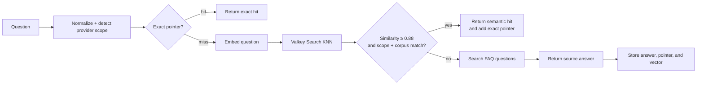

# Managed Valkey Services FAQ Semantic Cache

This demo is a FastAPI application that answers questions from the five managed
Valkey service FAQ files in [`../data`](../data):

- Amazon ElastiCache
- Google Cloud Memorystore for Valkey
- Heroku Key-Value Store
- Momento Cache
- OCI Cache

It does not require an LLM or an external API key. A local
`all-MiniLM-L6-v2` sentence-transformer embeds questions, and Valkey stores
exact pointers, answers, and prompt vectors with a TTL.

## Request flow



The cache follows the same pattern as the GenAI weather section:

1. Check an exact normalized-question pointer before running the model.
2. Search prior question vectors using Valkey Search and cosine similarity.
3. Require structured constraints in addition to vector similarity.
4. Promote semantic hits to exact pointers.
5. Keep source answers, exact pointers, and vectors in a versioned namespace.
6. Continue with FAQ retrieval when the cache is unavailable.

The constraints are:

- **Managed-service scope** — an ElastiCache question cannot reuse an OCI,
  Memorystore, Heroku, or Momento answer.
- **Corpus version** — changing any FAQ file changes its SHA-256 corpus digest,
  so stale entries are rejected until their TTL expires.

## 1. Install the demo

From `cache_me_if_you_can/semantic_cache`:

```bash
cp .env.example .env
uv sync --dev
```

The first request can download and initialize the sentence-transformer model.
Later requests use the local model cache.

## 2. Start Valkey Bundle

If port `16379` is not already serving the workshop Valkey Bundle:

```bash
docker compose up -d --wait
valkey-cli -p 16379 PING
```

Expected:

```text
PONG
```

Valkey Bundle includes the Search module required for the HNSW vector index.
If Search is unavailable, this compact demo logs a warning and uses a bounded
scan of cached vectors so semantic reuse still works for a small cache.

## 3. Start FastAPI

```bash
uv run uvicorn semantic_cache.api:app \
  --reload \
  --host 127.0.0.1 \
  --port 8000
```

Open the interactive API at `http://127.0.0.1:8000/docs`.

Check readiness:

```bash
curl -sS http://127.0.0.1:8000/health | python3 -m json.tool
```

The application parses 87 FAQ entries from the current `data` folder.

## 4. Seed the semantic cache

The first wording should miss the answer cache, retrieve the matching FAQ, and
store the result:

```bash
curl -i -sS \
  -X POST http://127.0.0.1:8000/ask \
  -H 'Content-Type: application/json' \
  -d '{"question":"What deployment choices does ElastiCache provide?"}'
```

Verify:

```text
X-Semantic-Cache-Hit: false
X-Semantic-Cache-Type: miss
```

The response identifies its source:

```json
{
  "source": {
    "provider": "Amazon ElastiCache",
    "file": "aws-elasticache-faq.md",
    "faq_question": "What deployment options do I have for ElastiCache?"
  },
  "cache": {
    "hit": false,
    "type": "miss"
  }
}
```

## 5. Ask a similar question

Use different wording with the same managed-service scope:

```bash
curl -i -sS \
  -X POST http://127.0.0.1:8000/ask \
  -H 'Content-Type: application/json' \
  -d '{"question":"Which deployment options are available for Amazon ElastiCache?"}'
```

With the included model, these two wordings have approximately `0.891` cosine
similarity, above the default `0.88` cache gate:

```text
X-Semantic-Cache-Hit: true
X-Semantic-Cache-Type: semantic
X-Semantic-Similarity: 0.89...
```

The response also includes the original cached wording in
`cache.matched_question`.

## 6. Repeat the second wording

Run the previous request again:

```bash
curl -i -sS \
  -X POST http://127.0.0.1:8000/ask \
  -H 'Content-Type: application/json' \
  -d '{"question":"Which deployment options are available for Amazon ElastiCache?"}'
```

The semantic hit created an exact pointer, so the third request skips embedding
inference and vector search:

```text
X-Semantic-Cache-Hit: true
X-Semantic-Cache-Type: exact
```

## 7. Verify provider isolation

An OCI question must not reuse an ElastiCache answer, even when its language is
similar:

```bash
curl -sS \
  -X POST http://127.0.0.1:8000/ask \
  -H 'Content-Type: application/json' \
  -d '{"question":"How many nodes does OCI Cache support?"}' \
  | python3 -m json.tool
```

Verify `source.provider` is `OCI Cache` and `cache.type` is `miss` on its first
request.

## 8. Inspect Valkey

```bash
valkey-cli -p 16379 --scan \
  --pattern 'semantic-faq-cache:v1:*'

valkey-cli -p 16379 FT.INFO semantic_faq_cache_v1
```

The namespace contains:

```text
semantic-faq-cache:v1:answer:<digest>
semantic-faq-cache:v1:prompt:<digest>
semantic-faq-cache:v1:embedding:<digest>
```

Each embedding hash stores:

- normalized and original question
- managed-service scope
- corpus version
- answer pointer
- 384-dimensional `FLOAT32` vector

View counters:

```bash
curl -sS http://127.0.0.1:8000/metrics | python3 -m json.tool
```

After the three-request cache journey, the important counters are one miss,
one semantic hit, one exact hit, and two embedding calls.

## Cache cleanup

Cache deletion is disabled by default. For an isolated workshop cache, set:

```dotenv
SEMANTIC_FAQ_CACHE_ALLOW_CLEAR=true
```

Restart the application, then clear only this demo's namespace:

```bash
curl -sS -X DELETE http://127.0.0.1:8000/cache \
  | python3 -m json.tool
```

Stop the included container with:

```bash
docker compose down
```

Do not stop it when another workshop module is using the same Valkey Bundle.

## Project layout

```text
semantic_cache/
├── semantic_cache/
│   ├── api.py          # FastAPI adapter
│   ├── cache.py        # Exact pointers and Valkey vector cache
│   ├── catalog.py      # Markdown FAQ parsing and semantic retrieval
│   ├── embeddings.py   # Lazy sentence-transformer adapter
│   ├── models.py       # Request and cache result models
│   ├── service.py      # Miss, semantic-hit, and exact-hit orchestration
│   └── settings.py     # Environment configuration
├── tests/
├── compose.yaml
├── Makefile
└── pyproject.toml
```
